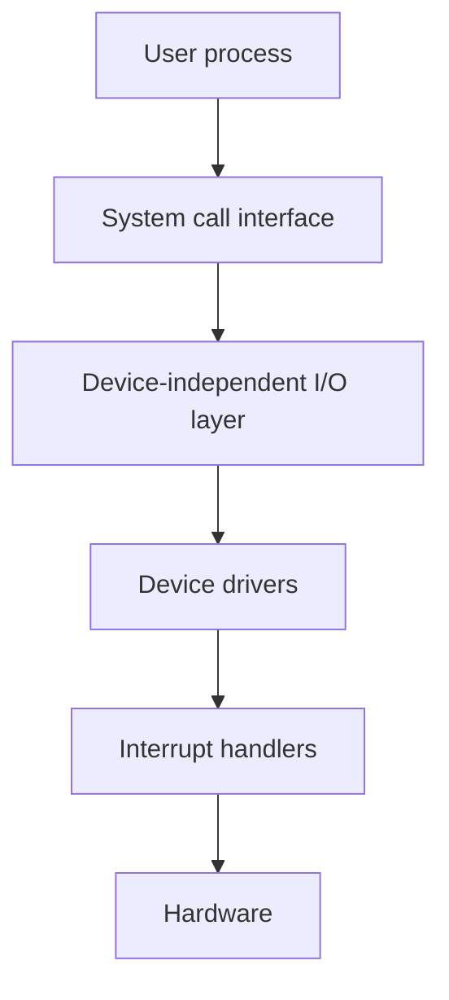
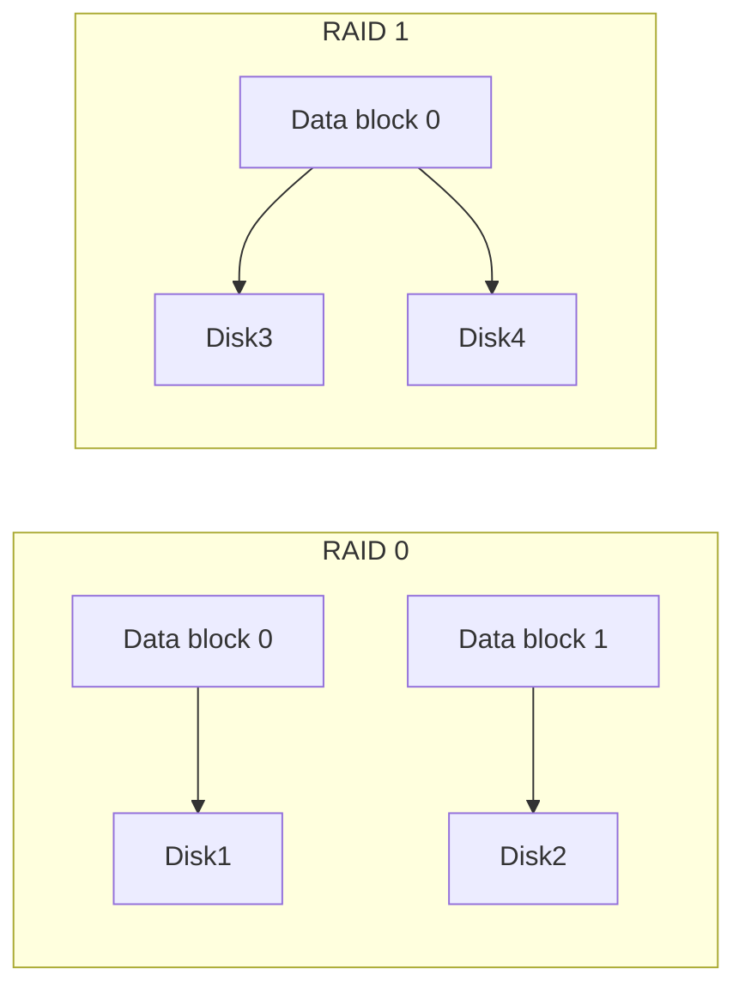

# Chapter 9: Input/Output Systems

Input/Output (I/O) is how the computer communicates with the outside world. This chapter covers the hardware and software that make I/O possible, from device controllers to interrupt handling, DMA, and disk arrays.

---

## I/O Hardware: Ports, Buses, Controllers

I/O devices connect to the computer through a hierarchy of hardware components.

### Ports

A **port** is a physical connector on the computer (e.g., USB port, Ethernet port, HDMI). It provides electrical and logical interface for a device. Each port is associated with one or more I/O addresses.

### Buses

A **bus** is a set of wires shared by multiple devices. Common buses:

| Bus | Typical use | Speed |
|-----|-------------|-------|
| PCIe | Graphics cards, NVMe SSDs | Several GB/s |
| SATA | Hard disks, SSDs | 6 Gb/s |
| USB | Keyboards, mice, flash drives | Up to 40 Gb/s (USB4) |
| Memory bus | CPU ↔ RAM | Very high (50‑100 GB/s) |

The **system bus** connects CPU, memory, and I/O bridges. The **I/O bus** (e.g., PCIe) connects I/O controllers.

### Controllers (Adapters)

A **controller** is a chip or circuit that manages a specific type of device. It handles low‑level protocols, buffering, and error correction. The OS communicates with the controller via registers (control, status, data).

**Example**: A disk controller receives read/write commands, translates logical block addresses to physical locations, and transfers data.

**Real‑life analogy**: A shipping port. The ship (device) docks at a specific berth (port). Cranes and customs officers (controller) unload and inspect cargo. The road network (bus) transports goods to the city.

---

## Polling vs Interrupts

The CPU needs to know when an I/O device is ready for data or has completed an operation. Two basic strategies.

### Polling

The CPU continuously checks the device’s status register in a loop. When the status indicates “ready,” the CPU performs the I/O.

```c
while ((status_register & READY_BIT) == 0) {
    // wait (busy loop)
}
// device ready – perform I/O
```

- **Pros**: Simple, no hardware overhead.
- **Cons**: Wastes CPU cycles (busy waiting), especially if devices are slow.

### Interrupts

The device sends a hardware **interrupt** signal to the CPU when it needs attention. The CPU finishes the current instruction, saves state, and jumps to the **interrupt handler** (interrupt service routine, ISR). After handling, it returns to the interrupted process.

- **Pros**: CPU is free to do other work while device is busy.
- **Cons**: Overhead of saving/restoring state; interrupt storms can overwhelm the system.

**Real‑life analogy**:
- **Polling**: A chef constantly looking at the oven every second to see if the cake is ready.
- **Interrupt**: The oven beeps (interrupt) when the cake is done; the chef continues chopping vegetables until then.

**Trade‑off**: Use polling for very fast devices (e.g., network card with always‑ready data) to avoid interrupt overhead. Use interrupts for slow devices (disks, keyboards).

---

## Direct Memory Access (DMA)

Without DMA, the CPU must copy every byte from the device to memory (Programmed I/O – PIO). This ties up the CPU for large transfers.

**DMA controller** is special hardware that transfers data directly between device and memory without CPU involvement. The CPU sets up the transfer (source, destination, count), then continues other work. When the transfer completes, the DMA controller sends an interrupt.

**Steps**:
1. CPU programs DMA controller: memory address, device, transfer size, direction.
2. DMA controller moves data (word by word or block by block) over the bus.
3. DMA controller asserts interrupt when done.

**Real‑life analogy**: A moving company. Without DMA (PIO), you carry each box yourself (CPU‑bound). With DMA, you hire movers – you tell them “move everything from room A to room B” and they do it while you do something else; they ring the bell when done.

---

## I/O Software Layers

Modern operating systems organise I/O into hierarchical layers, hiding complexity and providing uniform interfaces.



### 1. Interrupt Handlers

Lowest layer. When an interrupt occurs, the handler:
- Saves registers.
- Acknowledges the interrupt.
- Schedules a callback or wakes a waiting process.
- Restores context and returns.

### 2. Device Drivers

Driver is a **kernel module** that knows how to talk to a specific device (or class of devices). It translates generic OS commands (e.g., `read block 123`) into device‑specific register writes.

- Each driver implements a standard interface (open, read, write, ioctl).
- Approximately 70% of OS code can be in drivers (Linux, Windows).

### 3. Device‑Independent I/O Layer

Provides common services across all devices:
- **Uniform naming**: `/dev/sda`, `C:\`.
- **Protection**: Who can access which device.
- **Buffering**: Temporary storage to smooth data flow.
- **Error handling**: Retry, report, or ignore failures.
- **Allocation**: Manage shared devices (e.g., tape drives).

### 4. User‑Space I/O

Library functions (e.g., `printf`, `fread`) that call system calls (`read`, `write`). Some I/O can be done entirely in user space (e.g., memory‑mapped files, user‑mode drivers in microkernels).

**Real‑life analogy**: 
- **Interrupt handler**: Fire alarm bell – immediate action.
- **Driver**: The building’s electrician who knows exactly which wire controls which light.
- **Device‑independent layer**: Building codes and safety standards that apply to all electrical work.
- **User‑space**: You flipping a light switch.

---

## Buffering, Caching, Spooling

These techniques improve I/O performance and handle speed mismatches.

### Buffering

A **buffer** is a memory area that temporarily holds data while it is transferred between two entities (e.g., between device and application). Buffers decouple producer and consumer speeds.

**Types**:
- **Single buffer**: OS reads data into kernel buffer, then copies to user space.
- **Double buffering**: Use two buffers – one is filled while the other is being processed.
- **Circular buffer**: Multiple buffers in a ring.

**Real‑life**: A bread factory (fast producer) and a toaster (slow consumer). A delivery table (buffer) collects loaves; the toaster picks them up when ready.

### Caching

A **cache** holds recently used data in faster storage to reduce repeated slower I/O. Caching is different from buffering: cache stores **already used** data for possible reuse; buffer stores **in‑transit** data.

**Example**: Page cache in Linux – recently read disk blocks kept in free memory.

### Spooling (Simultaneous Peripheral Operation On‑Line)

A **spool** is a buffer that holds output for a slow device (e.g., printer). Each process writes its output to a spool file on disk. A background daemon (printer daemon) later prints the files.

**Advantage**: Processes do not wait for the printer; they continue immediately.

**Real‑life**: A receptionist’s inbox – people drop messages (spool) and the receptionist delivers them one by one.

---

## Block and Character Devices

| Type | Access | Examples | Typical interface |
|------|--------|----------|-------------------|
| **Block device** | Fixed‑size blocks, random access | Disk, SSD, USB drive | `read()`, `write()`, `seek()` |
| **Character device** | Stream of bytes, no seek | Keyboard, mouse, serial port | `getchar()`, `putchar()` (no random access) |

In Unix, block devices appear as files in `/dev`. Character devices also appear (e.g., `/dev/tty`). Some devices (e.g., network interfaces) are neither – they use socket interface.

---

## Disk Structure

Magnetic hard disks (HDDs) are still widely used; understanding their geometry helps optimise file systems.

### Components

A disk consists of:
- **Platters**: Circular metal/glass disks coated with magnetic material.
- **Spindle**: Rotates platters (5400, 7200, 10000 RPM).
- **Read/write heads**: One per platter surface, mounted on an **arm**.
- **Actuator**: Moves the arm across the platter.

### Geometric terms

| Term | Meaning |
|------|---------|
| **Track** | Concentric circle on a platter surface. |
| **Cylinder** | Set of tracks at the same arm position across all platters. |
| **Sector** | Smallest addressable unit (traditionally 512 bytes, now 4 KB). |
| **Head** | The read/write mechanism for one surface. |

**Capacity** = (bytes per sector) × (sectors per track) × (tracks per cylinder) × (cylinders) × (platters).

**Real‑life analogy**: A vinyl record player. The record (platter) spins. The needle (head) moves radially to different grooves (tracks). The same groove position across multiple records stacked vertically is a cylinder.

---

## RAID Levels

**RAID** (Redundant Array of Independent Disks) combines multiple physical disks into one logical unit for performance, reliability, or both.

### RAID 0 (Striping)

Data is striped across disks in blocks. No redundancy.
- **Pros**: High performance (parallel I/O).
- **Cons**: Any disk failure loses all data.
- **Use**: Temporary data, high‑performance scratch space.

### RAID 1 (Mirroring)

Every write goes to two (or more) disks. Reads can be from either.
- **Pros**: Excellent fault tolerance; good read performance.
- **Cons**: 2× storage cost.
- **Use**: OS disks, critical databases.

### RAID 5 (Striping with Parity)

Blocks and parity are striped across all disks. Parity is distributed (not on a single disk). Can tolerate **one** disk failure.
- **Pros**: Good read performance; efficient storage (1/N overhead).
- **Cons**: Slow writes (read‑modify‑write penalty).
- **Use**: File servers, general‑purpose storage.

### RAID 6

Like RAID 5 but with two parity blocks (different algorithms). Tolerates **two** disk failures.
- **Pros**: Very high fault tolerance.
- **Cons**: Even slower writes; 2/N overhead.
- **Use**: Large capacity systems, archival storage.

### RAID 10 (1+0)

Striped mirrors: first mirror, then stripe across mirror pairs (or stripe then mirror – both exist). Combines RAID 0 performance with RAID 1 fault tolerance.
- **Pros**: Excellent performance and fault tolerance (can lose one disk per mirror pair).
- **Cons**: Expensive (2× storage).
- **Use**: High‑performance databases, virtualisation hosts.

| RAID | Min disks | Fault tolerance | Read perf | Write perf | Capacity |
|------|-----------|----------------|-----------|------------|----------|
| 0 | 2 | None | High | High | N × disk |
| 1 | 2 | 1 disk | High | Medium | N/2 × disk |
| 5 | 3 | 1 disk | High | Low | (N‑1) × disk |
| 6 | 4 | 2 disks | High | Very low | (N‑2) × disk |
| 10 | 4 | Up to 2 (one per pair) | Very high | High | N/2 × disk |



**Real‑life analogy**: 
- **RAID 0**: Two runners in a relay holding half the message each – fast, but if one runner falls, the whole message is lost.
- **RAID 1**: Two students writing the same notes – if one loses their notebook, the other still has the complete information.
- **RAID 5**: A group of 4 friends who calculate a checksum for their shared document. If one friend leaves, the others can reconstruct missing parts from the checksum.

---

## Summary

| Concept | Key takeaway |
|---------|--------------|
| I/O hardware | Ports (connectors), buses (communication paths), controllers (device managers). |
| Polling | CPU continuously checks device status – simple but wastes cycles. |
| Interrupts | Device signals CPU when ready – efficient for slow devices. |
| DMA | Hardware transfers data without CPU; only setup and completion interrupt. |
| I/O software layers | Interrupt handlers → device drivers → device‑independent I/O → user‑space I/O. |
| Buffering | Temporary storage for in‑transit data (smooths speed mismatches). |
| Caching | Store reused data for faster future access. |
| Spooling | Buffer output for slow devices (printers). |
| Block vs character | Block devices: random access, fixed blocks; character: byte stream. |
| Disk structure | Tracks, cylinders, sectors – geometry affects scheduling. |
| RAID levels | 0 (striping, no redundancy), 1 (mirroring), 5 (parity, one fault), 6 (two faults), 10 (mirrored stripes). |

I/O systems complete the OS puzzle, bridging internal abstractions to the physical world. This chapter concludes our journey through operating systems fundamentals.