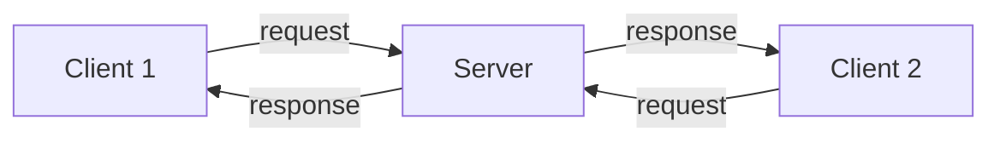
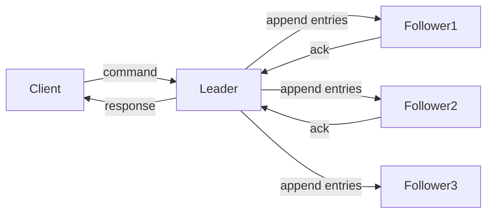

# Chapter 12: Distributed Operating Systems (Overview)

A distributed operating system manages a collection of independent computers (nodes) that appear to users as a single coherent system. This chapter introduces the core concepts: system models, communication, synchronization, mutual exclusion, distributed file systems, and consensus algorithms.

---

## Distributed System Models

Distributed systems can be classified by how nodes interact and share resources.

### Client‑Server Model

One or more **servers** provide services (e.g., file storage, database) to **clients** that request them. Servers are passive (wait for requests); clients are active (initiate requests).

- **Examples**: Web browsing (browser client, web server), email (mail client, mail server).
- **Communication**: Request‑reply over network (often TCP/IP).

### Peer‑to‑Peer (P2P) Model

All nodes (peers) are equal – each can act as both client and server. No central coordinator. Resources are shared directly between peers.

- **Examples**: BitTorrent (file sharing), Bitcoin (blockchain), Skype (early version).
- **Challenges**: Discovery, security, fault tolerance, incentive mechanisms.

**Real‑life analogy**:
- **Client‑server**: A library with a central librarian (server) – patrons (clients) ask the librarian for books.
- **Peer‑to‑peer**: A study group where each member brings books and shares directly – no leader.

---

## Remote Procedure Call (RPC) and Message Passing

Distributed components communicate by sending messages over a network. Two dominant models.

### Message Passing

Processes explicitly send and receive messages using `send(destination, message)` and `receive(source, message)`.

- **Synchronous (blocking)**: Sender waits until receiver accepts the message. Simpler but slower.
- **Asynchronous (non‑blocking)**: Sender continues immediately; messages are buffered. More efficient but requires care.

### Remote Procedure Call (RPC)

Makes communication look like a local procedure call. The client calls a function; the RPC system marshals arguments, sends a request to the server, unmarshals results, and returns them.

**Steps**:
1. Client calls `foo(args)` (client stub).
2. Stub marshals args into a message.
3. Transport sends message to server.
4. Server stub unmarshals args, calls local `foo`.
5. Results marshalled and sent back.
6. Client stub unmarshals result and returns to client.

**Challenges**:
- **Binding**: How does client know server’s address? (Registry, naming service)
- **Failure modes**: Server crash, network partition, lost messages.
- **Idempotency**: May need to retry without causing duplicate effects.

**Real‑life analogy**: A phone call with an interpreter. You speak in English (local call); interpreter translates to Japanese (message), the other person answers; interpreter translates back. You don't need to know the language or the phone network details.

---

## Network Transparency and Naming

**Network transparency** means that users and applications cannot tell whether a resource is local or remote. To achieve this, distributed systems need a unified **naming** scheme.

### Naming Requirements

- **Location transparency**: The name of a resource does not reveal its physical location (e.g., `file://server/share/doc.txt` – not fully transparent; better: UUID).
- **Location independence**: The resource can move without changing its name.

### Approaches

| Approach | Example | Transparency |
|----------|---------|--------------|
| **Host+path** | NFS: `server:/path` | Low (name includes server) |
| **Global namespace** | AFS (Andrew File System) – `/afs/cs.cmu.edu/file` | Medium (cell name included) |
| **Unique identifiers** | UUIDs, content‑addressed storage (IPFS) | High (location opaque) |

**Real‑life analogy**: 
- **Host+path**: “John in Room 204” (not transparent – move John, name changes).
- **Global namespace**: “John, employee ID 4711” (transparent – HR knows where John sits).
- **UUID**: John’s biometric template – you scan his fingerprint to find him anywhere.

---

## Distributed Synchronization: Lamport Clocks and Vector Clocks

In distributed systems, physical clocks on different nodes may drift. To order events, we use **logical clocks**.

### Lamport Clock (Lamport Timestamp)

Each process maintains a counter. Rules:
1. On an event inside a process, increment counter.
2. When sending a message, include current counter.
3. On receiving a message, set local counter = max(local, received) + 1.

**Happens‑before relation (→)**:
- If a and b are events in same process and a occurs before b, then a → b.
- If a sends a message and b receives it, then a → b.
- If a → b and b → c, then a → c.

Lamport clocks satisfy: if a → b then `L(a) < L(b)`. However, `L(a) < L(b)` does not imply a → b (concurrent events may have arbitrary order).

### Vector Clock

Each process keeps a vector of length N (number of processes). Rules:
- On internal event: increment own entry.
- On send: increment own entry, send entire vector.
- On receive: update each entry to max(local, received), then increment own entry.

**Properties**:
- `V(a) < V(b)` component‑wise iff a → b.
- Concurrent events have incomparable vectors.

**Real‑life analogy**:
- **Lamport clock**: A counter in a bakery. Tickets tell the order of events but two tickets with 5 and 5 could be unrelated.
- **Vector clock**: A log where each person has a personal counter. Comparing logs reveals exactly who knew what when.

---

## Distributed Mutual Exclusion

Multiple processes on different machines may need to access a shared resource (e.g., a printer, a file). Three classic algorithms.

### 1. Centralized Algorithm

One coordinator (server) grants permission. A process sends a request; if no one else holds the resource, coordinator grants it; otherwise, process is queued.

- **Pros**: Simple, fair, minimal messages (3 per critical section: request, grant, release).
- **Cons**: Single point of failure; coordinator bottleneck.

### 2. Distributed Algorithm (Ricart‑Agrawala)

All processes are equal. When a process wants to enter a critical section, it sends a request (with Lamport timestamp) to **all** other processes. It enters only when all others reply “OK”.

- A process replies immediately if it does **not** want the resource, or if its own request has a **later** timestamp (higher number = lower priority). Otherwise, it queues the request.
- **Messages**: 2×(N‑1) per entry (request + reply). High overhead.

### 3. Token‑Based Algorithm (Token Ring)

A single token circulates among processes in a logical ring. A process may enter the critical section only when it holds the token.

- **Pros**: No starvation; low overhead when demand is low (token passes regardless).
- **Cons**: Lost token requires recovery; latency proportional to ring size.

| Algorithm | Messages per CS | Fault tolerance | Coordinator |
|-----------|----------------|-----------------|-------------|
| Centralized | 3 (req, grant, rel) | Low (coordinator fails) | Yes |
| Ricart‑Agrawala | 2(N‑1) | High (any process can recover) | No |
| Token ring | 0 to N (token pass) | Medium (token loss) | No (logical ring) |

**Real‑life analogy**: A single‑key restroom in an office:
- **Centralized**: One secretary (coordinator) hands out the key on request.
- **Distributed**: Every employee has a list of all others; you call everyone. If someone else is already in the restroom, they say “I’m busy” unless your timestamp (urgency) is higher.
- **Token‑based**: Employees sit in a circle and pass a physical key around. Only the person holding the key can use the restroom.

---

## Distributed File Systems (NFS, AFS)

Distributed file systems allow files on remote servers to be accessed as if they were local.

### NFS (Network File System)

- **Developed by** Sun Microsystems (1984). Widely used in Unix/Linux.
- **Protocol**: Stateless – each request is independent (server does not remember client state).
- **Mounting**: Client mounts a remote directory to a local mount point (e.g., `mount server:/export /mnt`).
- **Transparency**: Partial – path includes server name or mount convention.
- **Cache consistency**: Weak (clients cache for few seconds; `close‑to‑open` consistency).

### AFS (Andrew File System)

- **Developed by** Carnegie Mellon University (1980s).
- **Protocol**: Stateful – server tracks which clients have which files.
- **Whole‑file caching**: When a client opens a file, the entire file is fetched to local disk (or memory). On close, if modified, whole file is sent back.
- **Scalability**: Uses cell hierarchy; excellent wide‑area performance.
- **Consistency**: Callback mechanism – server promises to notify clients when a file changes.

### Comparison

| Feature | NFS | AFS |
|---------|-----|-----|
| State | Stateless | Stateful (callbacks) |
| Caching | Block‑level, short timeout | Whole‑file, long‑term |
| Scalability | Good for LAN | Excellent for WAN |
| Consistency | Close‑to‑open | Callback + version |
| Complexity | Simpler | More complex |

**Real‑life analogy**: 
- **NFS**: A library where you can read pages one by one, but the librarian may re‑shelve the book at any moment (stateless).
- **AFS**: You check out the entire book, take it home, and the library promises to call you if someone else needs it (callback).

---

## Consensus: Paxos and Raft (Conceptual)

Consensus algorithms allow a set of distributed processes to agree on a single value even if some processes fail (crash or become unreliable). Used in distributed databases (e.g., etcd, ZooKeeper, Spanner).

### Paxos

Developed by Leslie Lamport (1990s). Famous for being difficult to understand but robust.

**Roles**:
- **Proposer**: Suggests a value.
- **Acceptor**: Votes on proposals.
- **Learner**: Learns the chosen value.

**Basic Paxos phases**:
1. **Prepare**: Proposer sends `prepare(proposal_number)` to a majority of acceptors.
2. **Promise**: Acceptor promises never to accept lower‑numbered proposals; returns last accepted value (if any).
3. **Accept**: Proposer sends `accept(proposal_number, value)` – value is either its own or the one returned.
4. **Accepted**: Acceptors accept if they haven't promised higher numbers; majority reached → consensus.

Paxos can be extended to **Multi‑Paxos** for a sequence of decisions (log replication).

### Raft

Designed to be more understandable than Paxos (Diego Ongaro, 2014). Uses **leader‑based** approach.

**Key components**:
- **Leader election**: One server is leader; others are followers. If followers hear nothing from leader (timeout), they start an election.
- **Log replication**: Leader accepts client commands, appends to its log, replicates to followers. When a majority accept, the command is committed.
- **Safety**: Only the leader with the most up‑to‑date log can be elected (prevents overwritten entries).

**Real‑life analogy**:
- **Paxos**: A committee without a chair. Each member can propose a motion; they vote in rounds, and some members may be absent (fail). Eventually, they agree on a single outcome – but the process is complicated.
- **Raft**: A team with an elected captain (leader). The captain tells everyone what to do. If the captain disappears, the team elects a new captain. Much simpler to follow.

---

## Summary

| Concept | Key takeaway |
|---------|--------------|
| Client‑server | Centralised server serves many clients (web, email). |
| Peer‑to‑peer | All nodes equal; no central coordinator (BitTorrent). |
| RPC | Remote call looks like local function call; hides network details. |
| Message passing | Explicit send/receive; more flexible but programmer‑visible. |
| Network transparency | Resource names hide location; global namespaces or UUIDs. |
| Lamport clock | Logical clock orders events; if a → b then L(a) < L(b). |
| Vector clock | Captures causal relationships; can detect concurrent events. |
| Distributed mutual exclusion | Centralised, distributed (Ricart‑Agrawala), token‑based algorithms. |
| NFS | Stateless, block‑caching, simple, for LAN. |
| AFS | Stateful, whole‑file caching, callbacks, for WAN. |
| Paxos | Classic consensus; robust but complex. |
| Raft | Leader‑based consensus; designed for understandability. |

Distributed operating systems extend the OS abstraction across multiple machines. While this chapter provided an overview, deeper study of networking, fault tolerance, and distributed algorithms is essential for building modern large‑scale systems.