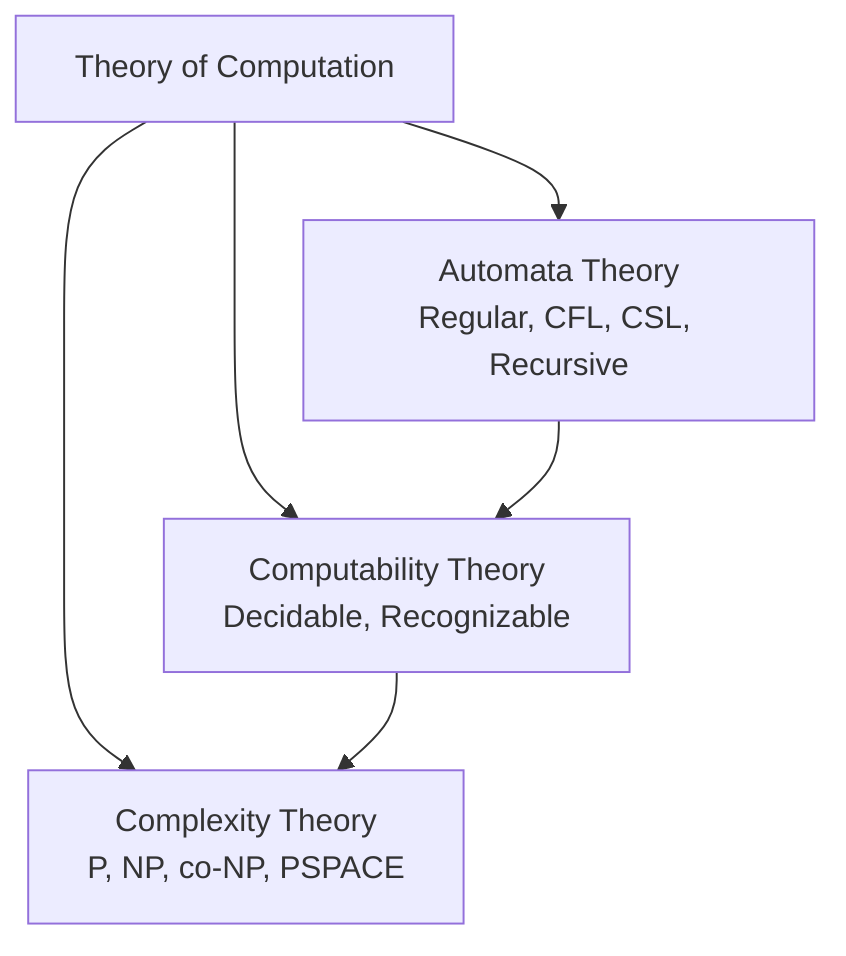
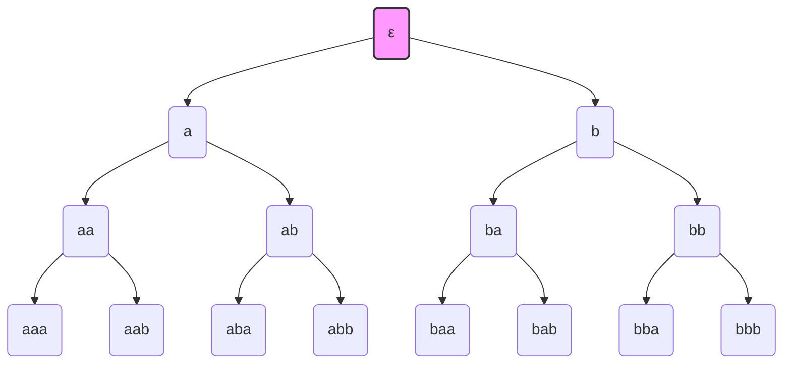
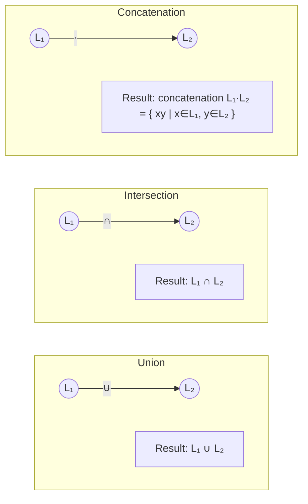
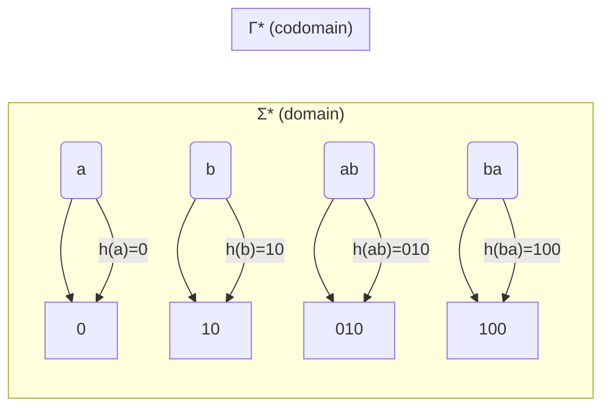

## Chapter 1: Introduction to Theory of Computation

This chapter provides a foundational overview of the Theory of Computation, its core branches, practical motivations, and essential mathematical definitions. All concepts are illustrated with examples and diagrams suitable for a technical audience.

---

## 1. What is Theory of Computation?

The Theory of Computation is a branch of computer science that explores the fundamental capabilities and limitations of computers. It seeks to answer questions such as: What problems can a computer solve? How efficiently can they be solved? Are there problems that are inherently unsolvable?

The field is broadly divided into three major areas:

| Area | Focus |
|------|-------|
| **Automata Theory** | Studies abstract machines (automata) and the language classes they define. Provides the mathematical foundation for lexical analysis, parsing, and pattern matching. |
| **Computability Theory** | Investigates which problems are solvable by any computational model (e.g., Turing machines). Identifies undecidable problems (e.g., the halting problem). |
| **Complexity Theory** | Classifies problems based on the resources (time, memory) required to solve them. Defines classes such as P, NP, and PSPACE. |

The relationship among these areas can be visualised as:

---

## 2. Motivation and Applications

The Theory of Computation is not purely abstract; it has direct practical impact across many domains.

### 2.1 Compilers
Automata theory forms the backbone of lexical analysis (scanning) and parsing. Regular expressions and finite automata are used to tokenise source code. For example, the lexical analyser of a C compiler recognises keywords (`if`, `while`), identifiers, numbers, and operators using deterministic finite automata (DFA).

### 2.2 Software Verification
Model checking, a technique to verify that a system satisfies given properties, relies heavily on automata theory. Temporal logic formulae are translated into automata (e.g., Büchi automata) and the system’s behaviour is checked against them. This is used in hardware verification, network protocols, and safety-critical systems.

### 2.3 Artificial Intelligence
Finite automata are used in natural language processing for morphological analysis and in game AI for state-based behaviours. Regular languages and finite-state transducers are employed in speech recognition and text-to-speech systems.

### 2.4 Cryptography
Complexity theory provides the security foundations for modern cryptography. The assumption that certain problems (e.g., integer factorisation, discrete logarithm) are not solvable in polynomial time underpins protocols like RSA and Diffie–Hellman. One‑way functions and zero‑knowledge proofs are also grounded in complexity classes.

---

## 3. Alphabets, Strings, and Languages – Basic Definitions

### 3.1 Alphabet
An **alphabet** is a finite, non‑empty set of symbols. It is typically denoted by Σ (sigma).

**Example:**  
Σ = {0, 1}  (binary alphabet)  
Σ = {a, b, c, …, z}  (lowercase letters)

### 3.2 String
A **string** (or **word**) is a finite sequence of symbols drawn from an alphabet. The length of a string w, denoted |w|, is the number of symbols it contains. The unique string of length zero is called the **empty string** and is denoted ε (epsilon).

**Example:**  
Over Σ = {0,1}: strings include ε, 0, 1, 00, 01, 10, 11, 000, …

### 3.3 Language
A **language** (over an alphabet Σ) is any set of strings formed from Σ. Languages can be finite or infinite. The set of all possible strings over Σ (including ε) is denoted Σ*.

**Example:**  
Σ = {a, b}  
L₁ = {ε, a, b}  (finite)  
L₂ = { w ∈ Σ* : w has an even number of a’s }  (infinite)  
L₃ = { aⁿ bⁿ : n ≥ 0 } = {ε, ab, aabb, aaabbb, …}

A visual representation of Σ* as a tree (all strings of length 0,1,2,…) is often helpful:

*Note: The tree continues infinitely; only the first three levels are shown.*

---

## 4. Operations on Strings

Strings support several fundamental operations.

### 4.1 Concatenation
If x and y are strings, their **concatenation** xy is the string formed by writing x followed by y. Formally, if x = a₁a₂…aₘ and y = b₁b₂…bₙ, then xy = a₁a₂…aₘb₁b₂…bₙ. The empty string ε is the identity: εx = xε = x.

**Example:**  
x = "hello", y = "world" → xy = "helloworld"

### 4.2 Reversal
The **reversal** of a string w, denoted wᴿ, is w written backwards. If w = a₁a₂…aₙ, then wᴿ = aₙ…a₂a₁.

**Example:**  
w = "abc" → wᴿ = "cba"  
εᴿ = ε

### 4.3 Substring
A **substring** of w is any contiguous block of symbols occurring within w. More formally, v is a substring of w if there exist strings x and y such that w = xvy.

**Example:**  
w = "abcdef"  
Substrings include "abc", "cde", "f", ε, and the whole string. "ace" is **not** a substring (not contiguous).

### 4.4 Length
The **length** |w| of a string w is the number of symbols in w.

**Properties:**  
|x y| = |x| + |y|  
|wᴿ| = |w|  
ε has length 0.

| Operation | Notation | Example (w₁ = "ab", w₂ = "cd") |
|-----------|----------|--------------------------------|
| Concatenation | w₁ w₂ | "abcd" |
| Reversal | wᴿ | "ba" |
| Substring | v ⊑ w | "bc" ⊑ "abcd" |
| Length | \|w\| | \|"ab"\| = 2 |

---

## 5. Operations on Languages

Since languages are sets of strings, set operations apply directly. Additional operations are specific to string sets.

Let L, L₁, L₂ be languages over an alphabet Σ.

### 5.1 Union
L₁ ∪ L₂ = { w : w ∈ L₁ or w ∈ L₂ }

**Example:**  
L₁ = {ε, a}, L₂ = {a, b} → L₁ ∪ L₂ = {ε, a, b}

### 5.2 Intersection
L₁ ∩ L₂ = { w : w ∈ L₁ and w ∈ L₂ }

**Example:**  
L₁ = {ε, a}, L₂ = {a, b} → L₁ ∩ L₂ = {a}

### 5.3 Concatenation
L₁ L₂ = { xy : x ∈ L₁, y ∈ L₂ }

**Example:**  
L₁ = {a, b}, L₂ = {c, d} → L₁ L₂ = {ac, ad, bc, bd}

### 5.4 Complement
The complement of L (with respect to Σ*) is L̅ = { w ∈ Σ* : w ∉ L }.

**Example:**  
Σ = {0,1}, L = { all strings ending with 0 }  
L̅ = { all strings ending with 1 } ∪ {ε} (if ε is not in L)

### 5.5 Kleene Star (Closure)
L* = ⋃_{i=0}^{∞} Lⁱ, where L⁰ = {ε} and Lⁱ = L L … L (i times).  
L* contains all concatenations of zero or more strings from L.

**Example:**  
L = {a} → L* = {ε, a, aa, aaa, …} = a* (regular expression notation)

### 5.6 Positive Closure
L⁺ = ⋃_{i=1}^{∞} Lⁱ = L L* (same as Kleene star but without ε unless ε ∈ L).

**Example:**  
L = {a} → L⁺ = {a, aa, aaa, …} (no ε)

### Diagram: Language Operations (Venn‑style)

*Note: Concatenation is not a set intersection – the diagram illustrates the operation symbolically.*

### Table of Language Operations

| Operation | Symbol | Definition | Example (Σ={a,b}) |
|-----------|--------|-------------|-------------------|
| Union | ∪ | {w : w∈L₁ ∨ w∈L₂} | L₁={a}, L₂={b} → {a,b} |
| Intersection | ∩ | {w : w∈L₁ ∧ w∈L₂} | L₁={a,b}, L₂={a} → {a} |
| Concatenation | · or nothing | {xy : x∈L₁, y∈L₂} | {a}·{b} = {ab} |
| Complement | ̅  or ^c | Σ* \ L | Σ={a}, L={a} → {ε} |
| Kleene star | * | ⋃_{i≥0} Lⁱ | {a}* = {ε,a,aa,…} |
| Positive closure | + | ⋃_{i≥1} Lⁱ | {a}+ = {a,aa,aaa,…} |

---

## 6. Homomorphism and Inverse Homomorphism

### 6.1 Homomorphism
A **homomorphism** (on strings) is a function h : Σ* → Γ* (where Σ, Γ are alphabets) such that for all strings x, y ∈ Σ*:
h(xy) = h(x) h(y)
and h(ε) = ε.  
A homomorphism is uniquely defined by its mapping on each symbol of Σ.

**Example:**  
Let Σ = {a, b}, Γ = {0,1}. Define h(a) = 0, h(b) = 10. Then  
h(ab) = h(a)h(b) = 0 10 = "010".  
h(ba) = h(b)h(a) = 10 0 = "100".  
h(aab) = h(a)h(a)h(b) = 0 0 10 = "0010".

For a language L ⊆ Σ*, the **homomorphic image** is h(L) = { h(w) : w ∈ L }.

### 6.2 Inverse Homomorphism
For a homomorphism h : Σ* → Γ*, the **inverse homomorphism** h⁻¹ : Γ* → 2^(Σ*) is defined by:
h⁻¹(v) = { w ∈ Σ* : h(w) = v }.

That is, h⁻¹ maps a string v over Γ to the set of all strings over Σ that map to v under h.

**Example:**  
Using the same h (h(a)=0, h(b)=10).  
h⁻¹(0) = { a } because h(a)=0, and no other string maps to 0 (h(b)=10, h(aa)=00, etc.).  
h⁻¹(10) = { b }? Actually h(b)=10, but also consider h(?) = 10? h(aa)=00, no. So only b.  
h⁻¹(010) = { ab } because h(ab)=010. Also possibly other strings? h(aab)=0010, no. So {ab}.

For a language M ⊆ Γ*, the **inverse homomorphic image** is h⁻¹(M) = { w ∈ Σ* : h(w) ∈ M }.

### Important Properties
- If L is regular, then h(L) is regular (regular languages are closed under homomorphism).
- If L is regular, then h⁻¹(L) is regular (regular languages are closed under inverse homomorphism).
- Homomorphisms preserve concatenation; inverse homomorphisms are useful for simplifying language proofs.

### Visual Representation of a Homomorphism

---

## Summary

This chapter introduced the core concepts of the Theory of Computation:

- The three pillars: Automata, Computability, Complexity.
- Practical motivations in compilers, verification, AI, and cryptography.
- Basic building blocks: alphabets, strings, languages.
- String operations: concatenation, reversal, substring, length.
- Language operations: union, intersection, concatenation, complement, Kleene star, positive closure.
- Homomorphism and inverse homomorphism, with closure properties.

These definitions form the language needed to study finite automata, pushdown automata, Turing machines, and complexity classes in subsequent chapters.

