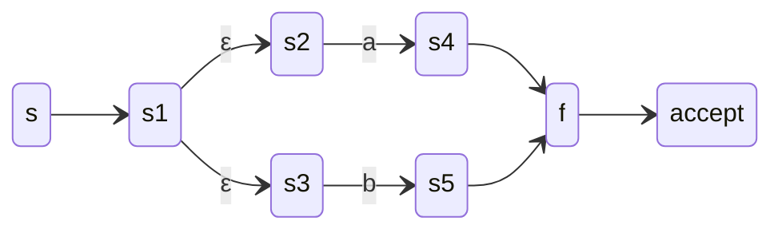
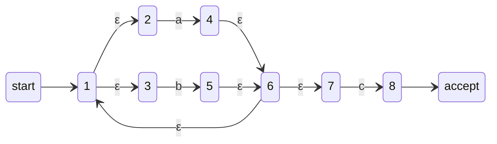
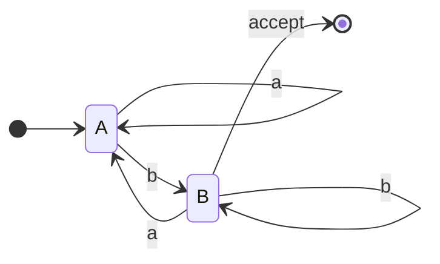
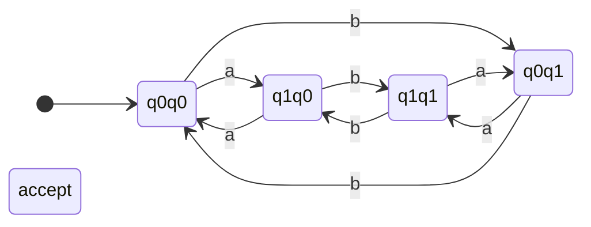

# Chapter 3: Regular Languages and Regular Expressions

This chapter covers the fundamental concepts of regular languages, their representation using regular expressions, conversions between regular expressions and finite automata, closure properties, and decision algorithms.

---

## 1. Regular Languages and Their Properties

A **regular language** is a language that can be recognized by a finite automaton (DFA or NFA), or equivalently, described by a regular expression. Regular languages are closed under various operations, meaning applying these operations to regular languages yields another regular language.

### Key Properties:
- **Closure under**: union, intersection, complement, concatenation, Kleene star, reversal, homomorphism, and more.
- **Decidability**: emptiness, finiteness, membership, equivalence are decidable.

---

## 2. Regular Expressions: Syntax and Semantics

A regular expression (regex) is an algebraic notation for describing a regular language. It uses constants and operators.

### Syntax (Formal Definition):
Let Σ be an alphabet. A regular expression R over Σ is defined recursively:

- **ε** (empty string) is a regular expression.
- **∅** (empty language) is a regular expression.
- **a** for each a ∈ Σ is a regular expression.
- If R₁ and R₂ are regular expressions, then:
    - **(R₁ | R₂)** – alternation (union)
    - **(R₁ · R₂)** – concatenation
    - **(R₁ \*)** – Kleene star (zero or more repetitions)
- Parentheses may be dropped with precedence: \* > · > |

### Semantics (Language Denoted):
Each regex R denotes a language L(R) ⊆ Σ\*:

| Expression | Language |
|------------|----------|
| ε          | { ε } |
| ∅          | { } (empty set) |
| a (∈ Σ)    | { a } |
| R₁ \| R₂   | L(R₁) ∪ L(R₂) |
| R₁·R₂      | { uv \| u ∈ L(R₁), v ∈ L(R₂) } |
| R\*        | { u₁u₂…uₖ \| k ≥ 0, each uᵢ ∈ L(R) } |

### Examples:
- `a|b` → {a, b}
- `(a|b)*` → all strings over {a,b}
- `a·b*` → strings starting with 'a' followed by zero or more 'b's (e.g., a, ab, abb)
- `(0|1)*·0` → binary strings ending with 0

---

## 3. Conversion of Regular Expression to Finite Automaton (Thompson’s Construction)

Thompson’s construction builds an **ε-NFA** (NFA with ε-transitions) for any regular expression. Each regex component is transformed into a small ε-NFA, then combined using ε-transitions.

### Base Cases:
- **ε**:  
  ```mermaid
  stateDiagram-v2
      direction LR
      start --> q0
      q0 --> q1 : ε
      q1 --> accept
  ```
- **a** (single symbol):  
  ```mermaid
  stateDiagram-v2
      direction LR
      start --> q0
      q0 --> q1 : a
      q1 --> accept
  ```
- **∅** (no accepting path): a single state with no transitions.

### Inductive Steps (for R₁ | R₂, R₁·R₂, R₁\*):
Given NFAs for R₁ and R₂ with single start and accept states:

1. **Union (R₁ | R₂)** – new start and accept states with ε-transitions to/from the component NFAs.
2. **Concatenation (R₁·R₂)** – connect accept state of R₁ to start state of R₂ via ε.
3. **Kleene Star (R₁\*)** – add ε-transitions from accept state back to start and from new start to new accept.

#### Example: Build ε-NFA for `(a|b)*c`

**Step 1:** NFA for `a|b` (union):


**Step 2:** Kleene star `(a|b)*` (add loop ε from f back to s).

**Step 3:** Concatenate with `c` (just a transition on c from accept of `(a|b)*` to a new accept state).

**Final ε-NFA** (simplified view):


Thompson’s construction ensures the number of states is O(|regex|) and each step adds at most 2 states.

---

## 4. Conversion of Finite Automaton to Regular Expression

Two standard methods: **state elimination** and **Arden’s theorem**.

### 4.1 State Elimination
Gradually remove states (except start and accept) while adding labels on edges that represent regular expressions.
- For each eliminated state q, update paths between its neighbors p and r: new label = `R_pr | (R_pq · R_qq* · R_qr)`

**Example:** Convert this DFA to regex (language: strings ending with 'b'):

**Eliminate B** (keeping A as start and accept):  
From A to A via B: `A -> B (b) -> A (a)` → `b a` + loop on B (b) → `b b* a` = `b+ a`.  
From A to A originally: `a`. New self-loop on A: `a | b+ a`.  
From A to accept (former B): path `A -> B (b)` with loop on B (b*) → `b b*` = `b+`.  
Thus regex: `(a | b+ a)* b+` which simplifies to `(a | b a)* b+`.

### 4.2 Arden’s Theorem
For equations of the form `X = A X | B`, where A, B are regex and ε ∉ L(A), the unique solution is `X = A* B`. Used to solve system of linear equations from a DFA.

**Example for same DFA:**  
Let A = language from start to A (accepting). B = language from start to B (non-accepting). Equations:
- A = A·a | B·a | ε   (ε because A is start)
- B = A·b | B·b
From second: B = (A·b) | (B·b) → B = A·b · b* = A b b* = A b+  
Substitute into first: A = A a | (A b+) a | ε = A (a | b+ a) | ε. By Arden: A = (a | b+ a)*. Since accepting state is B? Actually, in original DFA, the only accept state is B. So language L = B = A b+ = (a | b+ a)* b+.

---

## 5. Closure Properties of Regular Languages

Regular languages are closed under many operations. For each, we either construct a new automaton or use known equivalences.

| Operation | Construction / Proof |
|-----------|----------------------|
| **Union** | Given DFAs M₁, M₂, build product DFA with states (q₁,q₂). Accept if either original accepts. |
| **Intersection** | Same product, but accept if both accept. |
| **Complement** | For a DFA, swap accepting/non-accepting states (requires complete DFA). |
| **Concatenation** | Connect accepting states of M₁ to start of M₂ via ε (NFA) or use regex. |
| **Kleene star** | Add ε-loop from accept to start in NFA. |
| **Reversal** | Reverse all edges, swap start and accept (NFA → DFA). |
| **Homomorphism** | Apply string replacement to each symbol and run automaton. |

### Example: Union via Product Construction
Let L₁ = strings ending with 'a', L₂ = strings with even number of 'b's. Their union DFA:

Here state `xy` means: x = last char is 'a'? (q0=no, q1=yes), y = parity of b's (q0=even, q1=odd). Accept if x=1 (ends with a) OR y=0 (even b's).

---

## 6. Decision Properties

All decision properties for regular languages are decidable (can be solved algorithmically). Given representations (DFA, NFA, regex, ε-NFA).

### 6.1 Emptiness (L = ∅?)
- **Algorithm**: From start state, perform BFS/DFS for any accepting state. If reachable → non-empty.
- **Example**: DFA with no path to accept → empty.

### 6.2 Finiteness (L is finite or infinite?)
- **Algorithm**:
    1. Remove all states unreachable from start.
    2. Remove all states that cannot reach an accept.
    3. If the remaining graph has a cycle, language is infinite; else finite.
- **Example**: DFA with a loop on a → infinite (contains a*).

### 6.3 Membership (w ∈ L?)
- **Algorithm**: Simulate the automaton (DFA) on w. If end in accept → yes. For NFA, convert to DFA or simulate all paths.
- **Time**: O(|w|) for DFA.

### 6.4 Equivalence (L₁ = L₂?)
- **Algorithm**: Construct symmetric difference: (L₁ ∩ complement(L₂)) ∪ (complement(L₁) ∩ L₂). Check if empty.
- Alternatively, minimize both DFAs and compare canonical forms.
- **Example**: `(a|b)*` and `(a*b*)*` are equivalent.

### Decision Procedures Summary Table

| Property | Input | Complexity |
|----------|-------|-------------|
| Emptiness | DFA | O(n²) (reachability) |
| Finiteness | DFA | O(n²) (cycle detection) |
| Membership | DFA, word w | O(|w|) |
| Equivalence | DFA | O(n log n) (minimization) |

---

## Conclusion

Regular languages form the simplest class in the Chomsky hierarchy. Their equivalence with finite automata and regular expressions provides powerful tools for pattern matching, lexical analysis, and formal verification. The closure and decision properties allow systematic construction of language processors and correctness proofs.

**Further reading**:
- Convert ε-NFA to DFA (subset construction)
- Pumping lemma for non-regular languages
- Algebraic laws for regular expressions