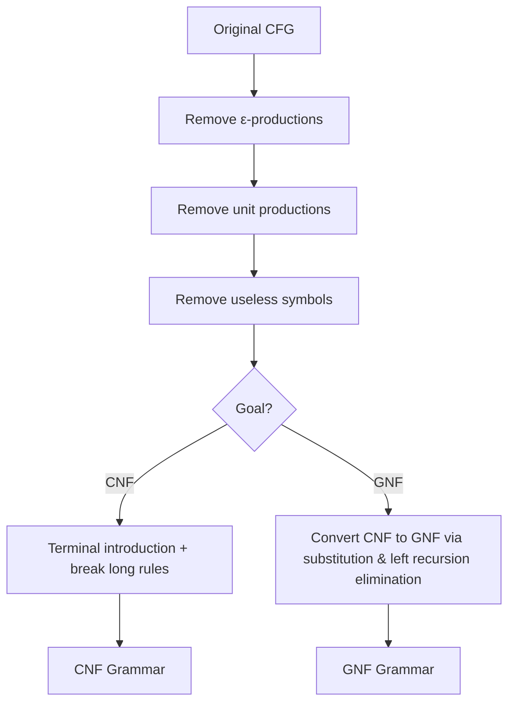

# Chapter 6: Simplification and Normal Forms of CFG

Context‑free grammars can be simplified by removing certain kinds of productions without changing the generated language. This simplification is essential for parsing algorithms (e.g., CYK requires CNF) and theoretical analysis.

---

## 1. Removal of ε‑Productions (Nullable Symbols)

An **ε‑production** is a rule of the form $A \to \varepsilon$.  
A non‑terminal $A$ is **nullable** if $A \Rightarrow^* \varepsilon$.

### Algorithm to eliminate ε‑productions:
1. Find all nullable non‑terminals.
2. For each production $A \to X_1 X_2 \dots X_k$, generate all possible productions where any subset of nullable symbols is omitted (but not all if the original had no terminals and becomes ε, except possibly for the start symbol).
3. Remove all ε‑productions.
4. If the start symbol $S$ is nullable, add $S' \to S \mid \varepsilon$ with a new start symbol $S'$.

### Example:
Grammar:  

```ebnf
S → AB
A → aA | ε
B → bB | ε
```

Nullable: $A, B$ (since each can derive ε), thus $S$ also nullable (via $S \Rightarrow AB \Rightarrow^* \varepsilon$).

New productions:
- For $S \to AB$: keep $AB$, also $A$ (omit B), $B$ (omit A), and $\varepsilon$ (omit both). But we will handle start symbol separately.
- For $A \to aA$: keep $aA$, and $a$ (omit A).
- For $B \to bB$: keep $bB$, and $b$ (omit B).

After removal of ε‑productions (and adding new start):

```ebnf
S' → S | ε
S → AB | A | B
A → aA | a
B → bB | b
```

---

## 2. Removal of Unit Productions

A **unit production** is of the form $A \to B$ where both $A$ and $B$ are non‑terminals.

### Algorithm:
1. Compute the **unit‑pair relation**: $(A,B)$ if $A \Rightarrow^* B$ using only unit productions.
2. For each such pair $(A,B)$ and each non‑unit production $B \to \alpha$ (where $\alpha$ is not a single non‑terminal), add $A \to \alpha$.
3. Remove all unit productions.

### Example (continuing from above):
Grammar has: $S \to A$, $S \to B$ (unit productions). Also $A \to aA \mid a$, $B \to bB \mid b$.

Unit pairs: $(S,S), (S,A), (S,B)$, and trivial pairs.

From $B \to bB \mid b$, add $S \to bB \mid b$.  
From $A \to aA \mid a$, add $S \to aA \mid a$.

After removal of unit productions:

```ebnf
S' → S | ε
S → AB | aA | a | bB | b
A → aA | a
B → bB | b
```

Note: $S \to AB$ remains because $AB$ is not a single non‑terminal.

---

## 3. Removal of Useless Symbols

A symbol (terminal or non‑terminal) is **useful** if it appears in some derivation from $S$ to a terminal string. Otherwise it is **useless**.  
Useless symbols come in two types:

- **Non‑generating** – cannot derive a terminal string.
- **Non‑reachable** – cannot be reached from the start symbol.

### Algorithm (two passes):
1. **Find generating symbols**:  
   Initialize set Gen = { all terminals }.  
   Repeat: if $A \to \alpha$ and every symbol in $\alpha$ is in Gen, add $A$ to Gen.  
   Remove all non‑generating non‑terminals and any productions containing them.
2. **Find reachable symbols**:  
   Start from $S$, traverse the graph of productions (treat non‑terminals as nodes).  
   Keep only reachable symbols and their productions.

### Example:

```ebnf
S → AB | a
A → a
B → bB
C → c
```

- **Generating**: terminals $\{a,b,c\}$.  
  $A \to a$ → A generating.  
  $S \to a$ → S generating.  
  $B \to bB$ needs B to be generating – but B not yet known. Since no base case for B, B is non‑generating. C is never used from S, but even if it were reachable, it’s generating ($C \to c$). However C is unreachable.  
  Remove B and its production.
- **Reachable** from S: S, then A (via $S \to AB$ but B gone? Actually after removal, $S \to AB$ is gone, $S \to a$ remains, so A is not reachable because no production from S to A remains. Wait careful: We first removed non‑generating B, so production $S \to AB$ is removed. Then only $S \to a$ remains. So A becomes unreachable. Also C unreachable.  
- Final grammar: $S \to a$.

Thus useless symbols eliminated correctly.

---

## 4. Chomsky Normal Form (CNF)

A CFG is in **Chomsky Normal Form** if every production is of the form:

- $A \to BC$ where $B, C$ are non‑terminals (not start symbol)
- $A \to a$ where $a$ is a terminal
- Optionally $S \to \varepsilon$ (only for start symbol)

### Conversion Algorithm (step‑by‑step):

**Step 1:** Eliminate ε‑productions (as above).  
**Step 2:** Eliminate unit productions (as above).  
**Step 3:** Eliminate useless symbols (as above) – optional but helps.  
**Step 4:** Convert all remaining productions to CNF:

- **For terminals in long rules**: For each terminal $a$ appearing in a production with length $\ge 2$, introduce a new non‑terminal $T_a$ and add $T_a \to a$. Replace $a$ by $T_a$.
- **Break long right‑hand sides**: For each production $A \to X_1 X_2 \dots X_k$ with $k \ge 3$, replace with:
  $A \to X_1 A_1$,  
  $A_1 \to X_2 A_2$, …,  
  $A_{k-2} \to X_{k-1} X_k$,  
  where each $A_i$ is a new non‑terminal.

### Example: Convert the following grammar to CNF

Original (after ε and unit removal, and useless elimination – but let’s start from a typical grammar):

```ebnf
S → AB | a
A → aAB | b
B → BA | a
```

**Step 4a – terminal introduction**:
- Terminals: a, b. Create $T_a \to a$, $T_b \to b$.
- Replace a by $T_a$, b by $T_b$ in RHS with length $\ge 2$.

Productions become:

```ebnf
S → AB | a          (keep S → a as is)
A → T_a A B | b
B → B A | a
T_a → a
T_b → b
```

**Step 4b – break long RHS**:
- $A \to T_a A B$ has length 3. Introduce new $A_1$:
  $A \to T_a A_1$  
  $A_1 \to A B$
- Others already have length 1 or 2:  
  $S \to AB$ (OK), $A \to b$ (OK), $B \to BA$ (OK), $B \to a$ (OK), $T_a \to a$ (OK), $T_b \to b$ (OK).

Final CNF grammar:

```ebnf
S → AB | a
A → T_a A_1 | b
A_1 → AB
B → BA | a
T_a → a
T_b → b
```

Note: $S \to a$ is allowed (terminal rule). All non‑terminal pairs are proper.

---

## 5. Greibach Normal Form (GNF)

A CFG is in **Greibach Normal Form** if every production is of the form:

$A \to a \alpha$  

where $a$ is a terminal, and $\alpha$ is a (possibly empty) string of non‑terminals.

Additionally, $S \to \varepsilon$ is allowed only if $\varepsilon$ is in the language.

### Significance:
- Every derivation step produces exactly one terminal.
- Useful for constructing pushdown automata that read one input symbol per step.

### Conversion approach (conceptual):
1. Convert grammar to CNF.
2. Rename non‑terminals to $A_1, A_2, \dots, A_n$.
3. Modify productions so that for each $A_i \to A_j \gamma$, we have $i < j$ (left‑recursion elimination).
4. For $i = n$ down to 1, transform all $A_i$-productions into GNF by substituting for leading non‑terminals.
5. Finally, any production $A_i \to A_i \gamma$ (left recursion) is replaced using standard left‑recursion removal.

**Example of GNF**:  

```ebnf
S → aAB | bB
A → aA | a
B → b
```

This is already in GNF (each RHS starts with a terminal).

---

## 6. Step‑by‑Step Conversion of Any CFG to CNF (Full Example)

Let’s take an arbitrary CFG and go through all simplifications + CNF.

### Original Grammar:

```ebnf
S → A | B
A → aAb | ε
B → bBa | ε
```

**Step 1: Remove ε‑productions**

Find nullable: $A$ (since $A \to \varepsilon$), $B$ (since $B \to \varepsilon$), hence $S$ nullable (via $S \to A$ or $B$).

Add new start $S' \to S \mid \varepsilon$.

For $A \to aAb$: generate $aAb$, $ab$ (omit the middle A). So $A \to aAb \mid ab$. Original $A \to \varepsilon$ removed.

Similarly for $B \to bBa$: produce $bBa \mid ba$.

Now we have:

```ebnf
S' → S | ε
S → A | B
A → aAb | ab
B → bBa | ba
```

**Step 2: Remove unit productions**

Unit pairs: $(S',S), (S,A), (S,B)$.

From $A \to aAb \mid ab$, add $S \to aAb \mid ab$.  
From $B \to bBa \mid ba$, add $S \to bBa \mid ba$.  
Also $S' \to S$ becomes $S' \to aAb \mid ab \mid bBa \mid ba$ (plus $S' \to \varepsilon$).

Remove all unit productions:

```ebnf
S' → aAb | ab | bBa | ba | ε
A → aAb | ab
B → bBa | ba
```

**Step 3: Remove useless symbols**

All symbols are generating: $a,b$ terminals, A and B derive terminals, S' derives terminals. All reachable from S'. No useless symbols.

**Step 4: Convert to CNF**

Introduce terminal non‑terminals:  
$T_a \to a$, $T_b \to b$.

Replace terminals in RHS of length $\ge 2$:

```ebnf
S' → T_a A T_b | T_a T_b | T_b B T_a | T_b T_a | ε
A → T_a A T_b | T_a T_b
B → T_b B T_a | T_b T_a
T_a → a
T_b → b
```

Now break long RHS ($\ge 3$):
- $S' \to T_a A T_b$: introduce $X_1 \to A T_b$, then $S' \to T_a X_1$
- $S' \to T_b B T_a$: introduce $X_2 \to B T_a$, then $S' \to T_b X_2$
- $A \to T_a A T_b$: introduce $Y_1 \to A T_b$, then $A \to T_a Y_1$
- $B \to T_b B T_a$: introduce $Z_1 \to B T_a$, then $B \to T_b Z_1$

All other productions already have length 1 or 2:  
$S' \to T_a T_b$ (OK), $S' \to T_b T_a$ (OK), $A \to T_a T_b$ (OK), $B \to T_b T_a$ (OK), and terminals.

Final CNF grammar:

```ebnf
S' → T_a X_1 | T_a T_b | T_b X_2 | T_b T_a | ε
X_1 → A T_b
X_2 → B T_a
A → T_a Y_1 | T_a T_b
Y_1 → A T_b
B → T_b Z_1 | T_b T_a
Z_1 → B T_a
T_a → a
T_b → b
```

All rules satisfy CNF.

---

## Summary of Normal Forms

| Normal Form | Production Restrictions | Use Case |
|-------------|------------------------|----------|
| **CNF** | $A \to BC$ or $A \to a$ | CYK parsing, decision algorithms |
| **GNF** | $A \to a\alpha$ ($\alpha \in V^*$) | Construction of PDA with one‑step terminal reading |

Both forms preserve the language (except removal of $\varepsilon$ from start in CNF requires special handling).

---

## Decision Flowchart for Simplification



---

**Further reading**: Converting to CNF and GNF is algorithmic; many textbooks detail left‑recursion elimination for GNF. The simplified grammar is essential for proving properties of CFLs (e.g., pumping lemma for CFLs uses CNF).
