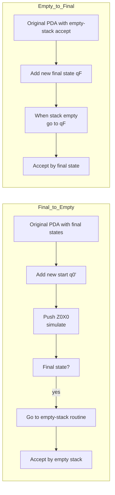
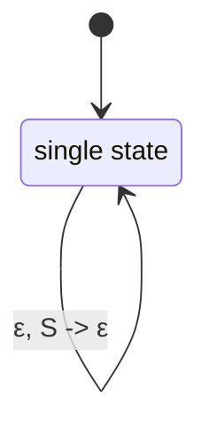
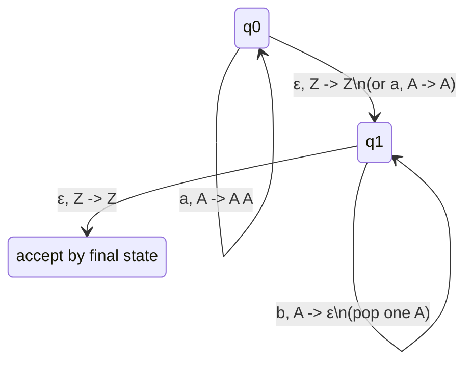

## Chapter 7: Pushdown Automata (PDA)

A **Pushdown Automaton (PDA)** extends a finite automaton with an unbounded stack, enabling it to recognize context-free languages. This chapter covers the formal definition, operational semantics, acceptance modes, equivalence with context-free grammars, and practical constructions.

---

### 7.1 Definition and Components (7-tuple)

A PDA is formally defined as a 7-tuple

```

M = (Q, Σ, Γ, δ, q₀, Z₀, F)

````

where

| Component | Meaning |
|-----------|---------|
| Q | finite set of **states** |
| Σ | finite **input alphabet** |
| Γ | finite **stack alphabet** |
| δ | **transition function**: Q × (Σ ∪ {ε}) × Γ → P(Q × Γ*) |
| q₀ ∈ Q | **start state** |
| Z₀ ∈ Γ | **initial stack symbol** |
| F ⊆ Q | set of **final states** (for acceptance by final state) |

The transition δ(q, a, X) = {(p, γ)} means:  
In state q, reading input a (or ε for epsilon-transition), with X on top of stack, the PDA may move to state p and replace X with the string γ (push/pop operations encoded in γ).

- **Push** Y: γ = YX (adds Y on top)
- **Pop** X: γ = ε
- **No change**: γ = X

> **Mermaid representation** (example transition):

```mermaid
stateDiagram-v2
    q0 --> q1 : a, X -> ε\n(pop X)
    q1 --> q2 : b, Y -> ZY\n(push Z)
````

---

### 7.2 Stack Operations and Instantaneous Descriptions (ID)

An **Instantaneous Description** (ID) is a triple (q, w, γ) representing the current state q, remaining input w, and stack content γ (top written leftmost).

**One move** ⊢ is defined:
(q, a w, X γ) ⊢ (p, w, β γ) if (p, β) ∈ δ(q, a, X) (where a ∈ Σ ∪ {ε}).

We write ⊢* for zero or more moves.

**Example sequence** for L = {aⁿ bⁿ} (pop a for each b):

```
(q₀, aabb, Z₀) ⊢ (q₀, abb, A Z₀) ⊢ (q₀, bb, AA Z₀) ⊢ (q₁, b, A Z₀) ⊢ (q₁, ε, Z₀)
```

---

### 7.3 Acceptance by Empty Stack vs Final State

A PDA can accept a string in two equivalent ways:

#### A. Acceptance by **Final State** (F)

```
L(M) = { w | (q₀, w, Z₀) ⊢* (q, ε, γ) for some q ∈ F, γ ∈ Γ* }
```

Stack content at acceptance is irrelevant.

#### B. Acceptance by **Empty Stack** (E)

```
N(M) = { w | (q₀, w, Z₀) ⊢* (q, ε, ε) for some q ∈ Q }
```

The stack must be completely empty; final states are not used.

#### Equivalence of the two modes

> **Theorem:** A language is accepted by a PDA by final state **iff** it is accepted by a (possibly different) PDA by empty stack.

**Construction (final → empty):**
Add a new start state q'₀ and a new stack bottom marker X₀. Push Z₀X₀, then simulate the original PDA. When the original enters a final state, jump to a new state that empties the stack.

**Construction (empty → final):**
Add a new final state q_f. When the stack becomes empty, jump to q_f. Also ensure that from q_f you can pop any remaining stack symbols (though none remain).



---

### 7.4 Equivalence of PDA and Context-Free Grammars

**Main theorem:** A language is context-free **iff** it is accepted by some PDA.

We prove two directions:

#### 7.4.1 CFG → PDA (Single-state construction)

Given a CFG G = (V, Σ, R, S) in **Greibach normal form** (all productions A → a α where a ∈ Σ, α ∈ V*), we build a PDA with **one state**:

```
M = ({q}, Σ, V, δ, q, S, ∅)
```

Transitions:

* For each production A → a B₁ B₂ ... Bₖ:
  δ(q, a, A) contains (q, B₁ B₂ ... Bₖ)
* For each terminal a (if a production A → a):
  δ(q, a, A) contains (q, ε)

**Intuition:** Stack holds the grammar's leftmost derivation. Reading an input symbol matches the terminal produced at the top of the stack.

**Example:** S → a S b | ε converted to Greibach:
S → a S B, B → b, plus S → ε.

PDA transitions:



---

### 7.4.2 PDA → CFG (from empty-stack acceptance)

Given a PDA M = (Q, Σ, Γ, δ, q₀, Z₀, ∅) that accepts by empty stack, we construct a CFG G with nonterminals [pXq].

---

### 7.5 Construction of PDA for Given Languages

#### Example 1: L = {aⁿ bⁿ | n ≥ 0}



---

### Summary

* A PDA is a 7-tuple with a stack, giving it memory.
* **Instantaneous descriptions** track state, remaining input, stack.
* **Final state** and **empty stack** acceptance are equivalent.
* PDA and CFG are equally expressive.

