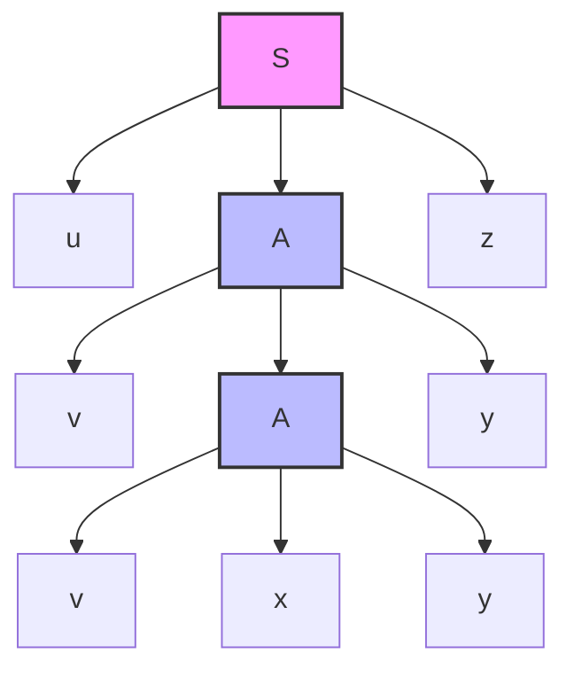
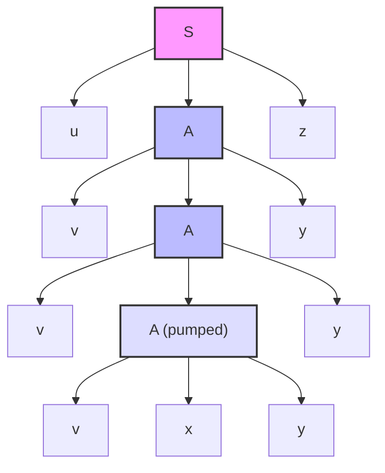
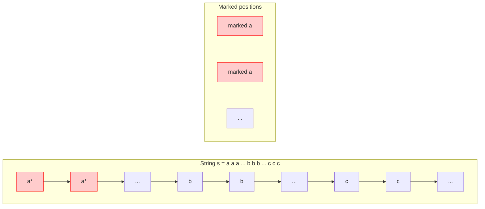

## Chapter 8: Pumping Lemma for Context-Free Languages

## 1. Statement of the Pumping Lemma (Parse-Tree View)

### Theorem (Pumping Lemma for CFLs)

Let $L$ be a context-free language. Then there exists a constant $p > 0$ (called the pumping length) such that any string $s \in L$ with $|s| \ge p$ can be written as:

$$
s = uvxyz
$$

with the following properties:

1. $|vxy| \le p$ (the middle part is bounded)
2. $|vy| \ge 1$ (at least one of $v$ or $y$ is non-empty)
3. $uv^i x y^i z \in L$ for all $i \ge 0$

---

### Intuition from Parse Trees

Assume the grammar is in **Chomsky Normal Form (CNF)**. If a string is long enough, some nonterminal repeats along a root-to-leaf path. The repeated nonterminal gives a subtree that can be duplicated or removed.

The split is:
- $u$: part to the left of the upper $A$
- $v$: part generated before reaching the lower $A$
- $x$: middle yield of the lower $A$
- $y$: part generated after the lower $A$
- $z$: part to the right of the upper $A$

By repeating the subtree rooted at the lower $A$, we get $uv^i x y^i z$.

---

## 2. Applications: Proving Languages Are Not Context-Free

To show a language $L$ is not context-free, assume it is context-free and derive a contradiction using the pumping lemma.

### Example 1

$$
L_1 = \{a^n b^n c^n \mid n \ge 0\}
$$

**Proof sketch:**
Assume $L_1$ is context-free. Let $p$ be the pumping length. Choose:

$$
s = a^p b^p c^p \in L_1, \quad |s| = 3p \ge p
$$

By the lemma, $s = uvxyz$ with $|vxy| \le p$ and $|vy| \ge 1$.
Since $|vxy| \le p$, the substring $vxy$ cannot cover all three symbol blocks ($a$, $b$, and $c$). Consider cases:

- **Case 1:** $vxy$ contains no $c$. Pumping changes only $a$ and/or $b$, so counts can no longer be all equal.
- **Case 2:** $vxy$ contains no $a$. Pumping changes only $b$ and/or $c$, again breaking equality.
- **Case 3:** $vxy$ contains no $b$. Pumping changes only $a$ and/or $c$, breaking equality.

All cases contradict membership in $L_1$. Hence $L_1$ is not context-free.

---

### Example 2

$$
L_2 = \{ww \mid w \in \{a,b\}^*\}
$$

Choose $s = a^p b^p a^p b^p$. Because $|vxy| \le p$, the pumped segment lies in a small local region (or crosses the center only slightly). Pumping destroys the exact two-copy structure $ww$. Contradiction follows from case analysis.

---

### Example 3 (Context-Free Language for Contrast)

$$
L = \{a^n b^m c^n d^m \mid n,m \ge 0\}
$$

A grammar for $L$ is:

$$
S \to aSc \mid T, \quad T \to bTd \mid \varepsilon
$$

This reminds us that the pumping lemma is not a tool to prove that a language is context-free; it is mainly used to disprove context-freeness.

---

## 3. Limitations of the CFL Pumping Lemma and Ogden's Lemma

The pumping lemma gives a **necessary** condition for CFLs, not a sufficient one. Some non-CFLs can still satisfy the standard pumping condition.

### Ogden's Lemma (Stronger Tool)

Ogden's lemma allows us to mark positions in the string. The pumpable parts must interact with marked positions, making proofs stronger.

**Simplified statement:**
For any CFL $L$, there exists a constant $p$ such that for any string $s \in L$ with at least $p$ marked positions, we can write $s = uvxyz$ with:

1. $|vxy| \le p$
2. $|vy| \ge 1$
3. $v$ and $y$ together include at least one marked position
4. $uv^i x y^i z \in L$ for all $i \ge 0$

---

### Why Marking Helps

Marking forces pumping to affect the critical region instead of an irrelevant region.

---

### Example Often Handled Better with Ogden's Lemma

$$
L = \{a^i b^j c^k \mid i = j \text{ or } j = k, \text{ but not both}\}
$$

This language is not context-free, but the standard pumping-lemma proof is difficult and may fail. Ogden's lemma can target the right positions to derive contradiction cleanly.

---

### Comparison

| Property | Standard Pumping Lemma | Ogden's Lemma |
| --- | --- | --- |
| Necessary condition for CFL | Yes (weaker) | Yes (stronger) |
| Sufficient condition | No | No |
| Proves $\{a^n b^n c^n\}$ is non-CFL | Yes | Yes |
| Handles tricky interleavings better | Limited | Better |

---

### Key Takeaway

Use the standard pumping lemma for classic non-CFL proofs. If the segment bound $|vxy| \le p$ is too weak to force contradiction, use Ogden's lemma by marking strategically chosen positions.